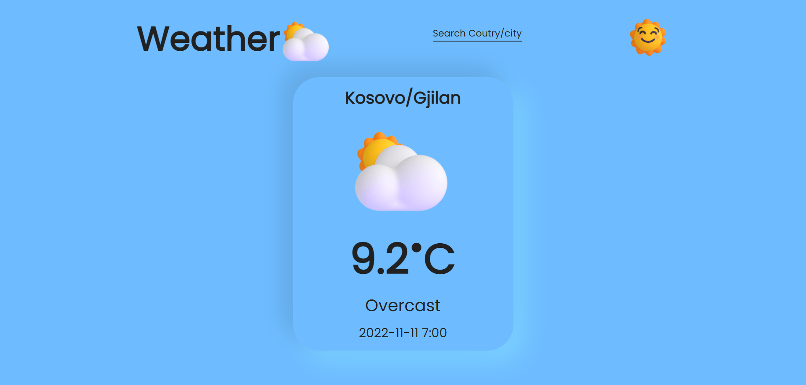
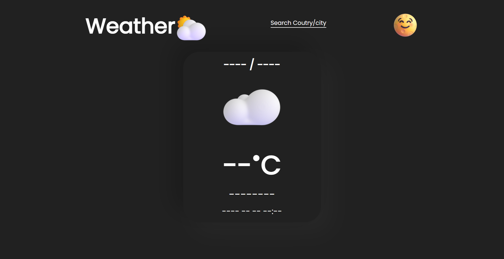

# Current Weather

## The fastest and easiest way to get current weather is to visit [Current Weather](https://motiaktual.netlify.app/)

**Screenshots of the website because I have a callback limit and here you can see what the website would look like**

  
Preview Screenshots

  

    
    
    
    
    
    
    
    
  

#

*Technology that was used*: **Html**, **CSS**, **React Js.**
